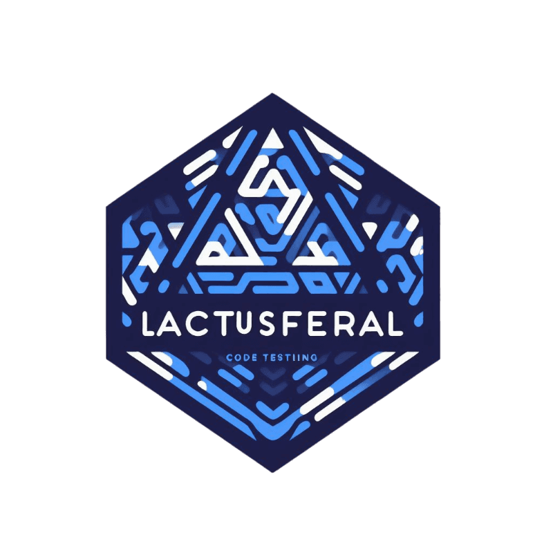

<h3 align="center"></h3>

<h2 align="center">Lactusferal | experimentos</h2>

#### C/C++, [Python](https://python.org)...
##### Automatization, CMake, Makefile...

## Topicos iniciais:
  - Fundamentos da linguagem C++
  - Uma abordagem mais profunda da própia _orientação a objeto_.
  - Programação de forma _procedural_
  - E montagem de infraestrutara
  - Utilização mais arrojada de automatizadores como `cmake`
    - Em POO, se aprofundar nos conceitos de _herança_ e _polimorfismo_

## Softwares Utéis:
  - [https://godbolt.org/](https://godbolt.org/), observar um resultado _"Low Level"_ da linguagem, como `assembly`
